# E-kontakt (Electronic Contact)

AMQP-based bidirectional messaging between citizens and healthcare providers via Helsenorge.

**API Name:** `DIALOG_INNBYGGER_EKONTAKT`  
**Technology:** AMQP (Advanced Message Queuing Protocol)

## When to use

- Administrative, non-clinical dialogs with citizens.
- Either party (citizen or provider) needs to start or continue a threaded dialog.
- Attachments need to accompany the dialog.

## Channel and authentication

- Transport: AMQP on NHN messaging infrastructure.
- Auth/transport setup follows NHN AMQP requirements (cert-based). Use the queue configuration assigned by NHN.

## Message flows

Inline view:

```mermaid
%% keep in sync with Ekontakt_Flow.mmd
sequenceDiagram
	participant Citizen as 👤 Citizen
	participant HN as 🌐 Helsenorge
	participant AMQP as 📨 AMQP
	participant EPJ as 🏥 Healthcare System

	rect rgb(240, 248, 255)
		Note over Citizen,EPJ: Citizen Initiates Contact
		Citizen->>HN: Send message
		HN->>AMQP: Forespørsel fra innbygger
		AMQP->>EPJ: Deliver to health contact
	end

	rect rgb(240, 255, 240)
		Note over EPJ,Citizen: Healthcare Responds
		EPJ->>AMQP: Svar fra helsekontakt
		AMQP->>HN: Forward response
		HN->>Citizen: Display message
	end

	rect rgb(255, 250, 240)
		Note over EPJ,Citizen: Healthcare Initiates
		EPJ->>AMQP: Forespørsel fra helsekontakt
		AMQP->>HN: Forward to citizen
		HN->>Citizen: Display message
		Citizen->>HN: Reply
		HN->>AMQP: Svar fra innbygger
		AMQP->>EPJ: Deliver reply
	end

```



Source file: [Ekontakt_Flow.mmd](Ekontakt_Flow.mmd)

Citizen-initiated: `ForespørselFraInnbygger` → `SvarFraHelsekontakt`.
Provider-initiated: `ForespørselFraHelsekontakt` → `SvarFraInnbygger`.

## Diagrams

- Flow: [Ekontakt_Flow.mmd](Ekontakt_Flow.mmd)
- Citizen-initiated relations: [Relations/CitizenInitiatedRelations.mmd](Relations/CitizenInitiatedRelations.mmd)
- Provider-initiated relations: [Relations/ProviderInitiatedRelations.mmd](Relations/ProviderInitiatedRelations.mmd)
- Classes: [Classes folder](Classes/)

## Payloads and classes

Classes: [EkontaktMelding](Classes/EkontaktMelding.mmd), [Vedlegg](Classes/Vedlegg.mmd), [ForespørselFraInnbygger](Classes/ForespørselFraInnbygger.mmd), [SvarFraHelsekontakt](Classes/SvarFraHelsekontakt.mmd), [ForespørselFraHelsekontakt](Classes/ForespørselFraHelsekontakt.mmd), [SvarFraInnbygger](Classes/SvarFraInnbygger.mmd).

Core fields ([EkontaktMelding](Classes/EkontaktMelding.mmd)):

| Norwegian    | English     | Description                   |
| ------------ | ----------- | ----------------------------- |
| dialogId     | Dialog ID   | Unique thread identifier      |
| meldingsId   | Message ID  | Unique message identifier     |
| tema         | Topic       | Subject of the message        |
| innhold      | Content     | Message body                  |
| opprettet    | Created At  | Timestamp                     |
| avsenderType | Sender Type | Who sent the message          |
| vedlegg      | Attachments | List of attached files        |
| filnavn      | Filename    | Attachment filename           |
| storrelse    | Size        | File size in bytes            |
| innbyggerId  | Citizen ID  | National ID (fødselsnummer)   |
| tjeneste     | Service     | Healthcare service identifier |
| sendt        | Sent        | Send timestamp                |


## [Attachments](Classes/Vedlegg.mmd)

| Field       | Description                          |
| ----------- | ------------------------------------ |
| `filnavn`   | Filename                             |
| `mimeType`  | MIME type (PDF/JPG/PNG)              |
| `innhold`   | File content (base64-encoded)        |
| `storrelse` | Size in bytes                        |


| Format | MIME Type       | Notes     |
| ------ | --------------- | --------- |
| PDF    | application/pdf | Documents |
| JPG    | image/jpeg      | Images    |
| PNG    | image/png       | Images    |

## [ForespørselFraInnbygger](Classes/ForespørselFraInnbygger.mmd)

| Field            | Description                  |
| ---------------- | ---------------------------- |
| `innbyggerId`    | Citizen ID (fødselsnummer)   |
| `tjeneste`       | Healthcare service identifier|
| `meldingInnhold` | Message content              |
| `vedlegg`        | Attachments                  |

```mermaid
%% keep in sync with Classes/ForespørselFraInnbygger.mmd
classDiagram
	class ForespørselFraInnbygger {
		+String innbyggerId
		+String tjeneste
		+String meldingInnhold
		+Vedlegg[] vedlegg
	}

```

## [SvarFraHelsekontakt](Classes/SvarFraHelsekontakt.mmd)

| Field          | Description                        |
| -------------- | ---------------------------------- |
| `dialogId`     | Dialog ID the response belongs to  |
| `svarInnhold`  | Response content                   |
| `sendt`        | Sent timestamp                     |
| `vedlegg`      | Attachments                        |


## [ForespørselFraHelsekontakt](Classes/ForespørselFraHelsekontakt.mmd)

| Field            | Description                  |
| ---------------- | ---------------------------- |
| `innbyggerId`    | Citizen ID (fødselsnummer)   |
| `tjeneste`       | Healthcare service identifier|
| `meldingInnhold` | Message content              |
| `vedlegg`        | Attachments                  |

```mermaid
%% keep in sync with Classes/ForespørselFraHelsekontakt.mmd
classDiagram
	class ForespørselFraHelsekontakt {
		+String innbyggerId
		+String tjeneste
		+String meldingInnhold
		+Vedlegg[] vedlegg
	}

```

## [SvarFraInnbygger](Classes/SvarFraInnbygger.mmd)

| Field          | Description                        |
| -------------- | ---------------------------------- |
| `dialogId`     | Dialog ID the response belongs to  |
| `svarInnhold`  | Response content                   |
| `sendt`        | Sent timestamp                     |
| `vedlegg`      | Attachments                        |


## Sources

- Helsenorgetjenester overview: https://helsenorge.atlassian.net/wiki/spaces/HELSENORGE/pages/690749444/Helsenorgetjenester
- Meldingsutveksling med Helsenorge: https://helsenorge.atlassian.net/wiki/spaces/HELSENORGE/pages/690913297/Meldingsutveksling+med+Helsenorge
- Teknisk integrasjon med Helsenorge og PVK: https://helsenorge.atlassian.net/wiki/spaces/HELSENORGE/pages/691175425/Teknisk+integrasjon+med+Helsenorge+og+Personvernkomponenten+PVK
