# AMQP Notifikasjon Helsekontakt

**API Name:** `NOTIFIKASJON_INNBYGGER_HELSEKONTAKT`  
**Technology:** AMQP + FHIR  
**Status:** In Production (since Apr 2023)  
**Use case:** General health contact notifications (new solution, under pilot)

## When to use

- Send new or updated health contact info to citizens.
- Enable digital dialog between citizen and provider via Helsenorge.

## Channel and authentication

- Transport: AMQP on NHN messaging infrastructure (cert-based).
- Sender must be registered in Address Registry with Level 2 HerId.

## Diagrams

- Flow: [AMQP_Notifikasjon_Flow.mmd](AMQP_Notifikasjon_Flow.mmd)
- EpisodeOfCare relations: [Relations/EpisodeOfCareRelations.mmd](Relations/EpisodeOfCareRelations.mmd)
- Classes: [Classes folder](Classes/)

Inline flow:

```mermaid
%% keep in sync with AMQP_Notifikasjon_Flow.mmd
sequenceDiagram
	participant EPJ as 🏥 Healthcare System
	participant AMQP as 📨 AMQP Broker
	participant HN as 🌐 Helsenorge

	rect rgb(240, 248, 255)
		Note over EPJ,HN: Create/Update Health Contact
		EPJ->>AMQP: Notifikasjon Helsekontakt
		Note right of EPJ: MsgHead + FHIR EpisodeOfCare
		AMQP->>HN: Forward Message
	end

	rect rgb(240, 255, 240)
		Note over HN,EPJ: Acknowledgment
		HN->>AMQP: Applikasjonskvittering
		AMQP->>EPJ: Delivery Confirmation
	end

	rect rgb(255, 250, 240)
		Note over HN,EPJ: Citizen Uses Service
		HN->>AMQP: Dialog Message
		AMQP->>EPJ: Citizen Communication
	end

```

Source file: [AMQP_Notifikasjon_Flow.mmd](AMQP_Notifikasjon_Flow.mmd)

## Message structure

Classes: [MsgHead](Classes/MsgHead.mmd), [EpisodeOfCare](Classes/EpisodeOfCare.mmd), [CareTeam](Classes/CareTeam.mmd), [Participant](Classes/Participant.mmd), [AccessSecurity](Classes/AccessSecurity.mmd).

### [MsgHead](Classes/MsgHead.mmd) (Header)

Contains sender, receiver, and patient info. The actual health contact is in the Document section as FHIR resource.

| Element         | Description             |
| --------------- | ----------------------- |
| MsgId           | Unique message ID       |
| Type            | Message type            |
| Ack             | Acknowledgment settings |
| Sender/Receiver | Organization info       |
| Patient         | Patient info            |
| Document        | FHIR EpisodeOfCare      |

### FHIR Resources

Uses two FHIR resources:

#### [EpisodeOfCare](Classes/EpisodeOfCare.mmd)

| Field                | Description                          |
| -------------------- | ------------------------------------ |
| id                   | Episode identifier                   |
| status               | Current status                       |
| meta.security        | Access restriction (for youth 12-16) |
| patient              | Reference to patient                 |
| managingOrganization | Healthcare organization              |
| careTeam             | Contained CareTeam                   |

#### [CareTeam](Classes/CareTeam.mmd) (contained)

| Field       | Description                        |
| ----------- | ---------------------------------- |
| name        | Team/service name                  |
| participant | List of healthcare personnel/roles |

### [AccessSecurity](Classes/AccessSecurity.mmd) Enum (meta.security)

For patients aged 12-15, must specify access restrictions:

| Code        | Norwegian                 | English                            |
| ----------- | ------------------------- | ---------------------------------- |
| N           | Normal                    | Both parents and youth have access |
| NORN_FORANS | Nektet, foreldreansvarlig | Parents denied (youth only)        |
| NORN_UNGDOM | Nektet, ungdom            | Youth denied (parents only)        |

_Source: Volven kodeverk 9603_

## Dialog Categorization (New Feature - Nov 2025)

Health contacts can now specify dialog categories:

- Helps EPJ route incoming messages to correct personnel
- Citizen sees category options when sending messages
- If no categories defined, feature is hidden from citizen

Implemented via CareTeam participants with different roles.

## [Flow](AMQP_Notifikasjon_Flow.mmd)

1. **Healthcare System** sends notification via AMQP
2. Message contains `MsgHead` + FHIR `EpisodeOfCare`
3. **Helsenorge** processes and returns acknowledgment
4. Citizen can now use digital services (dialog, appointments)
5. Citizen messages flow back via AMQP Dialog

## Standards

- Hodemelding v1.2
- FHIR EpisodeOfCare: http://helsenorge.no/fhir/StructureDefinition/hn-specialist-EpisodeOfCare
- FHIR CareTeam: http://helsenorge.no/fhir/StructureDefinition/hn-specialist-EpisodeOfCare_containedCareTeam

## Sources

- AMQP Notifikasjon Helsekontakt: https://helsenorge.atlassian.net/wiki/spaces/HELSENORGE/pages/1975418911/AMQP+Notifikasjon+Helsekontakt
- Meldingsutveksling med Helsenorge: https://helsenorge.atlassian.net/wiki/spaces/HELSENORGE/pages/690913297/Meldingsutveksling+med+Helsenorge
