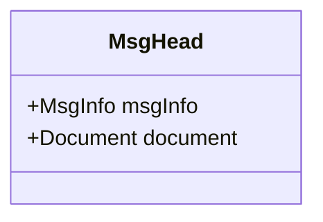
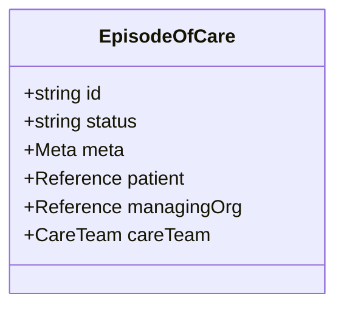
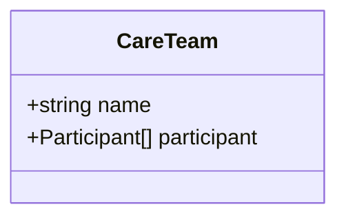
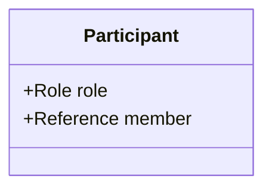
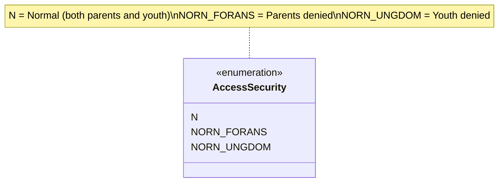

# Classes

Message header and FHIR resource snippets used in AMQP Notifikasjon Helsekontakt.

- [MsgHead.mmd](MsgHead.mmd) – Hodemelding wrapper



## MsgInfo fields, cardinality and notes

- `msgId` : 1 — MUST be a UUID (Universally Unique Identifier). This is the unique message identifier in the Hodemelding.
- `type` : 1 — Message type identifier. For Notifikasjon use code `NOTIFIKASJON_INNBYGGER_HELSEKONTAKT` (see code list 8279).
- `ack` : 1 — Acknowledgment setting; indicates whether an application receipt is required (the PDF specifies that `Ack` should be set to request an application receipt).
- `sender` : 1 — Sender information. MUST include HER-id on two organisational levels (virksomhet and kommunikasjonspart). See XML example below.
- `receiver` : 1 — Receiver information. MUST include HER-id on two organisational levels (virksomhet and kommunikasjonspart).
- `patient` : 1 — Patient identification; use code set for person identifier (8116). For digital dialog the patient identifier is required.

Example XML excerpt (Sender / Receiver with HER-id):

```xml
<Sender>
	<Organisation>
		<OrganisationName>UNIVERSITETSSYKEHUSET NORD-NORGE HF</OrganisationName>
		<Ident>
			<Id>9</Id>
			<TypeId V="HER" DN="HER-id" S="2.16.578.1.12.4.1.1.9051" />
		</Ident>
	</Organisation>
</Sender>
```

Example XML excerpt (EpisodeOfCare.managingOrganization):

```xml
<EpisodeOfCare>
	<managingOrganization>
		<identifier>
			<system value="urn:oid:2.16.578.1.12.4.1.2" />
			<value value="05073500186" />
		</identifier>
		<!-- Skal være HERID på nivå 2 for den organisasjon som er ansvarlig for denne behandlingen -->
	</managingOrganization>
</EpisodeOfCare>
```

- [EpisodeOfCare.mmd](EpisodeOfCare.mmd) – FHIR EpisodeOfCare payload



- [CareTeam.mmd](CareTeam.mmd) – Contained CareTeam



- [Participant.mmd](Participant.mmd) – Care team participant



- [AccessSecurity.mmd](AccessSecurity.mmd) – Access restriction codes


