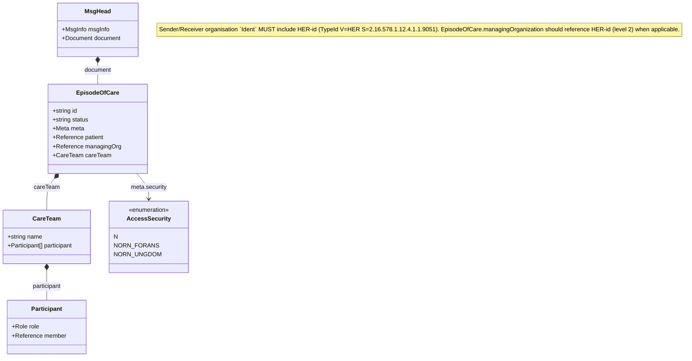

# Relations

Mermaid diagrams of class relationships for AMQP Notifikasjon Helsekontakt.

- [EpisodeOfCareRelations.mmd](EpisodeOfCareRelations.mmd) – Hodemelding to FHIR resource links

```mermaid
classDiagram

class MsgHead {
	+MsgInfo msgInfo
	+Document document
}

class EpisodeOfCare {
	+string id
	+string status
	+Meta meta
	+Reference patient
	+Reference managingOrg
	+CareTeam careTeam
}

class CareTeam {
	+string name
	+Participant[] participant
}

class Participant {
	+Role role
	+Reference member
}

class AccessSecurity {
	<<enumeration>>
	N
	NORN_FORANS
	NORN_UNGDOM
}

MsgHead *-- EpisodeOfCare : document
EpisodeOfCare *-- CareTeam : careTeam
CareTeam *-- Participant : participant
EpisodeOfCare --> AccessSecurity : meta.security

note "Sender/Receiver organisation `Ident` MUST include HER-id (TypeId V=HER S=2.16.578.1.12.4.1.1.9051). EpisodeOfCare.managingOrganization should reference HER-id (level 2) when applicable."

```
