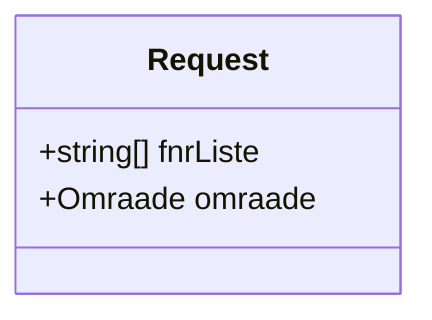
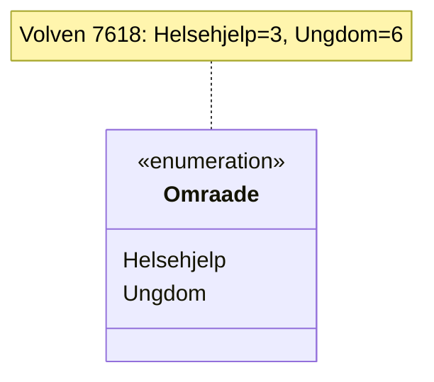
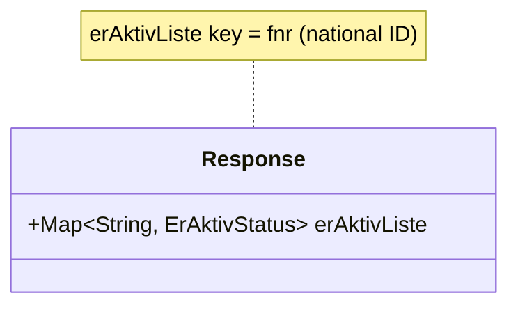
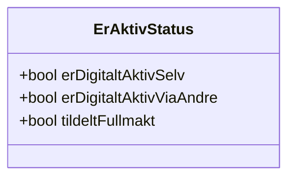

# Classes

Domain models for HelsenorgeAktivSjekken requests and responses.

- [Request.mmd](Request.mmd) – Request payload fields

- [Omraade.mmd](Omraade.mmd) – Context area enum

- [Response.mmd](Response.mmd) – Response wrapper with status map

- [ErAktivStatus.mmd](ErAktivStatus.mmd) – Activity status flags

